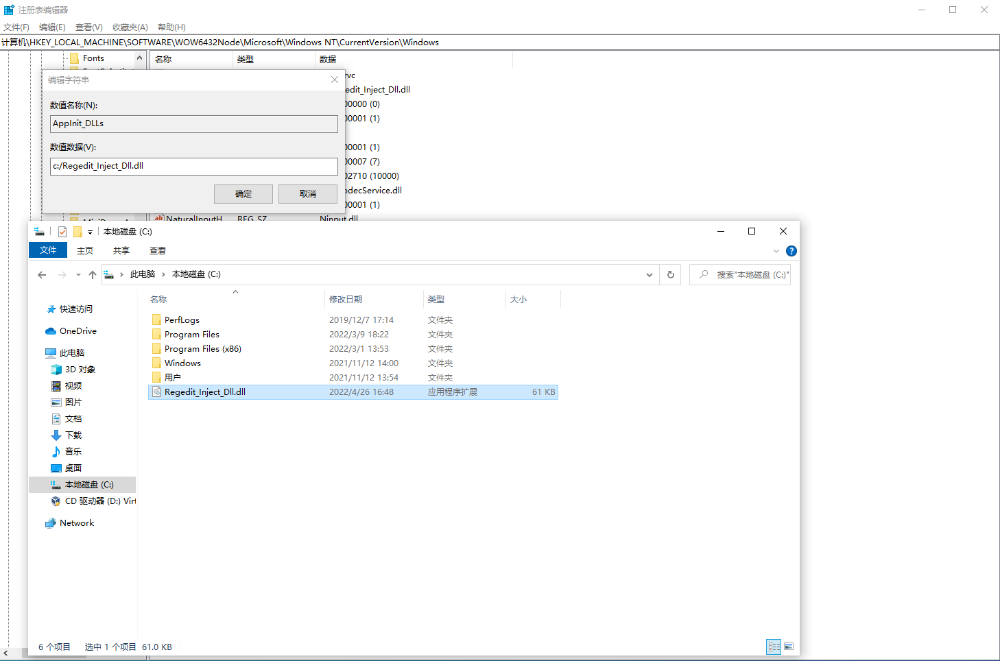

# Regedit_Inject_Dll

## 利用注册表注入Dll

不知道为啥，我在Win10虚拟机跑的，没成功:(

regedit注册表路径：

- **计算机\HKEY_LOCAL_MACHINE\SOFTWARE\WOW6432Node\Microsoft\Windows NT\CurrentVersion\Windows**

截图：

这张的注册表路径错了，后面改对了也不行。

推测应该时Use32.dll没加载这个Dll，win10的问题，win7暂时没试